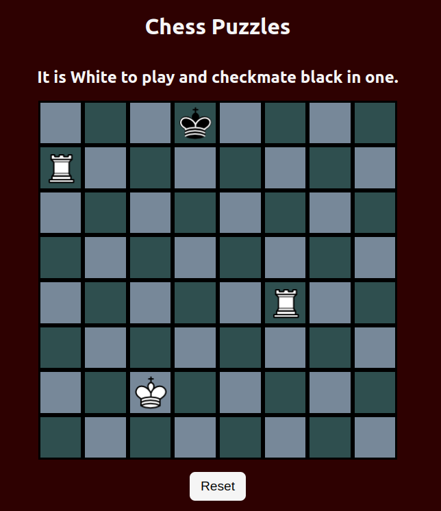

# ChessPuzzler
Play chess puzzles [here](https://js-chess-puzzles.netlify.app/)

I was inspired to create this game by playing chess puzzles with my coffee every morning.  You can find the app I use [here](https://play.google.com/store/apps/details?id=net.lrstudios.android.chess_problems)

Technologies used:
1. VS Code
2. JavaScript
3. CSS
4. HTML
5. Gimp

Image assets (chess pieces) aquired from [here](https://commons.wikimedia.org/wiki/Category:PNG_chess_pieces/Standard_transparent)

Icebox (future plans):
1. Introduce other chess pieces (knights and pawns).
2. Create more puzzles.
3. Implement stalemate logic.
